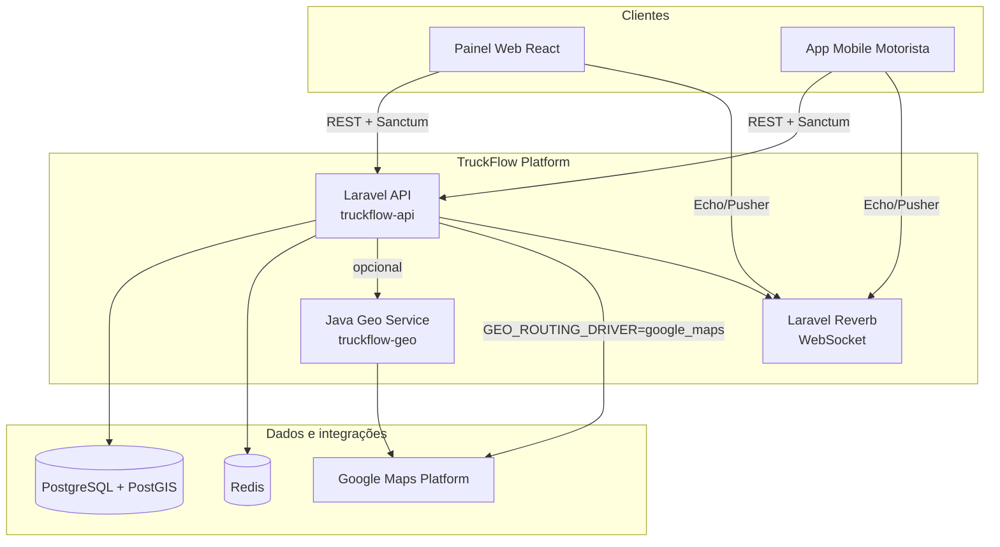
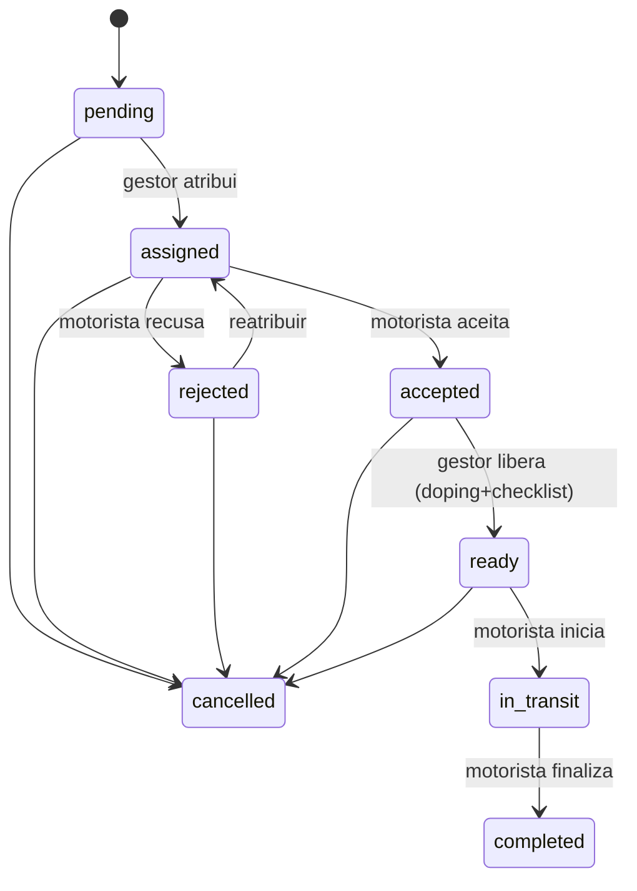

# TruckFlow — Arquitetura

---

## 1. Visão do sistema (C4 — Nível 1)



| Componente | Repositório | Responsabilidade |
|------------|-------------|------------------|
| **API principal** | `truckflow-api` | Domínio, multi-tenant, workflow, auth, auditoria |
| **Geo service** | `truckflow-geo` | Roteamento e Places (fronteira para escala/polyglot) |
| **Painel web** | `truckflow-web` (futuro) | UX gestor/admin |
| **App mobile** | `truckflow-mobile` (futuro) | UX motorista em campo |

---

## 2. Contexto delimitado (Bounded Contexts)

```
┌────────────────┐  ┌────────────────┐  ┌────────────────┐
│   Identity &   │  │    Freight &   │  │   Fleet &      │
│   Tenancy      │  │   Logistics    │  │   Documents    │
├────────────────┤  ├────────────────┤  ├────────────────┤
│ Auth (Sanctum) │  │ Workflow 8 est.│  │ Trucks/Trailers│
│ Tenants/Users  │  │ Waypoints/SOS  │  │ CNH/CRLV upload│
│ Roles/Policies │  │ PostGIS rotas  │  │ Doping tests   │
└────────────────┘  └────────────────┘  └────────────────┘

┌────────────────┐  ┌────────────────┐
│  Geolocation   │  │ Observability  │
├────────────────┤  ├────────────────┤
│ RoutingProvider│  │ SystemLog      │
│ Google ou Java │  │ RequestLog     │
│ GPS tracking   │  │ ActivityLog    │
└────────────────┘  └────────────────┘
```

---

## 3. Camadas da API Laravel

```
HTTP Request
    ↓
Middleware (auth:sanctum, throttle, LogApiRequest)
    ↓
Controller (thin) — delega
    ↓
Form Request — validação + authorize()
    ↓
Service — regra de negócio, transações
    ↓
Model + Policy + Enum
    ↓
PostgreSQL / Redis / Storage / Events
```

### Princípios aplicados

| Princípio | Como aparece no código |
|-----------|------------------------|
| **SRP** | Um service por contexto (`FreightWorkflowService`, `IncidentService`) |
| **DIP** | `RoutingProvider` — Google direto ou Java via config |
| **Fail fast** | `ValidationException` para regras; exceções inesperadas → `SystemLogger` |
| **Multi-tenant** | `BelongsToTenant` trait — scope global + preenchimento na criação |
| **Audit trail** | `LogsActivity` em models de domínio |

---

## 4. Decisões arquiteturais (ADR resumido)

### ADR-001 — PostgreSQL + PostGIS

**Contexto:** Fretes têm origem, destino, waypoints e tracking GPS.

**Decisão:** Colunas `geography(Point, 4326)` com extração via `ST_X`/`ST_Y`.

**Alternativas rejeitadas:** Lat/lng em colunas float (sem índices espaciais nativos).

---

### ADR-002 — Laravel Sanctum (não Passport)

**Contexto:** API consumida por SPA/mobile com tokens simples.

**Decisão:** Sanctum bearer tokens, stateful API habilitada para futuro SPA same-origin.

**Alternativas:** OAuth2 completo — complexidade desnecessária no MVP.

---

### ADR-003 — Workflow como service, não state machine library

**Contexto:** 8 estados de frete com transições validadas em `FreightStatus::canTransitionTo()`.

**Decisão:** Orquestração em `FreightWorkflowService` + enum — explícito e testável.

**Alternativas:** Biblioteca de state machine — over-engineering para o tamanho atual.

---

### ADR-004 — Microserviço Java para geo (opcional)

**Contexto:** Demonstrar arquitetura políglota e preparar escala de chamadas Google.

**Decisão:** `truckflow-geo` (Spring Boot) com contrato REST; Laravel usa `RoutingProvider`.

**Configuração:**
```env
GEO_ROUTING_DRIVER=google_maps   # padrão — sem Java
GEO_ROUTING_DRIVER=java          # delega ao microserviço
GEO_JAVA_SERVICE_URL=http://truckflow-geo:8081
```

**Alternativas:** Tudo no Laravel — válido para produção pequena; Java é opt-in.

---

### ADR-005 — Telemetria em banco (não Sentry no MVP)

**Contexto:** Painel admin precisa de histórico de requisições e erros.

**Decisão:** Tabelas `request_logs` e `system_logs` + middleware `LogApiRequest`.

**Evolução:** Exportar para Sentry/Datadog em produção madura.

---

### ADR-006 — Testes com DatabaseTransactions

**Contexto:** Suite de 110+ testes contra PostgreSQL real.

**Decisão:** Transação por teste + `migrate --env=testing` antes da suite (sem `migrate:fresh` por teste).

**Trade-off:** Schema deve estar migrado; ganho de velocidade e previsibilidade.

---

## 5. Fluxo de frete (máquina de estados)



Pré-requisitos para `ready → in_transit`:
- Doping aprovado
- Checklist enviado
- Gestor liberou viagem (`approve`)

---

## 6. Segurança e isolamento multi-tenant

1. **Autenticação:** `auth:sanctum` em todas as rotas protegidas.
2. **Autorização:** Policies por model (`FreightPolicy`, `TruckPolicy`, …).
3. **Isolamento de dados:** `BelongsToTenant` filtra queries pelo `tenant_id` do usuário autenticado.
4. **Admin panel:** middleware `admin` + verificação explícita de `tenant_id` em logs.
5. **Testes:** `TenantIsolationTest` garante que tenant A nunca acessa dados do tenant B.

---

## 7. Integração truckflow-api ↔ truckflow-geo

### Directions

```http
POST /api/v1/directions
Content-Type: application/json

{
  "origin": { "lat": -23.55, "lng": -46.63 },
  "destination": { "lat": -22.90, "lng": -43.17 },
  "waypoints": [{ "lat": -23.10, "lng": -46.00 }]
}
```

### Places nearby

```http
GET /api/v1/places/nearby?lat=-23.55&lng=-46.63&type=gas_station&radius=5000
```

### Subir stack completa

```bash
# Na pasta truckflow-api
docker compose -f compose.yaml -f docker-compose.geo.yml up -d
```

Defina no `.env` da API:
```env
GEO_ROUTING_DRIVER=java
GEO_JAVA_SERVICE_URL=http://truckflow-geo:8081
```

---

## 8. Integração truckflow-api ↔ truckflow-fiscal (CT-e mock)

### Emitir CT-e

```http
POST /api/v1/cte/emit
Content-Type: application/json

{
  "freight_id": 42,
  "cargo_name": "Soja em grãos",
  "cargo_weight": 25.5,
  "total_value": 3500.00,
  "issuer": {
    "cnpj": "12345678000199",
    "ie": "123456789",
    "razao_social": "Transportadora Teste LTDA",
    "uf": "SP",
    "municipio": "São Paulo"
  }
}
```

### Fluxo na API Laravel

1. Admin configura dados fiscais: `PUT /api/v1/tenant/fiscal`
2. Gestor emite CT-e após frete concluído: `POST /api/v1/freights/{id}/fiscal-documents/cte`
3. XML/PDF armazenados em disco privado; download via endpoints dedicados
4. Cancelamento: `POST /api/v1/freights/{id}/fiscal-documents/{doc}/cancel`

### Subir stack fiscal

```bash
docker compose -f compose.yaml -f docker-compose.fiscal.yml up -d
```

```env
FISCAL_DRIVER=java
FISCAL_JAVA_SERVICE_URL=http://truckflow-fiscal:8082
```

---

## 9. Observabilidade

| Tipo | Tabela / Canal | Público |
|------|----------------|---------|
| Auditoria de negócio | `activity_logs` | Gestor/Admin |
| Telemetria HTTP | `request_logs` | Admin |
| Erros técnicos | `system_logs` + `laravel.log` | Admin |
| Tempo real | Reverb (`driver.location.updated`, `freight.sos.triggered`) | Clientes conectados |

Endpoints admin: `/api/v1/admin/*` (role `admin`).

---

## 10. Qualidade de código

| Ferramenta | Comando | CI |
|------------|---------|-----|
| Laravel Pint | `composer lint` | ✅ job `quality` |
| PHPStan (Larastan) nível 5 | `composer analyse` | ✅ com baseline |
| PHPUnit/Pest | `composer test` | ✅ job `tests` |

---

## 11. Roadmap técnico

- [ ] OpenTelemetry + export para Grafana
- [ ] Outbox pattern para eventos de domínio
- [ ] `truckflow-web` consumindo API + Reverb
- [ ] Serviço Java de ingestão GPS (Kafka) em alto volume
- [ ] Integração CT-e real com SEFAZ (certificado A1, ambiente produção)

---

## Referências

- [README principal](../README.md)
- [Brief frontend web](./FRONTEND-WEB-BRIEF.md)
- [truckflow-geo README](../../truckflow-geo/README.md)
- [truckflow-fiscal README](../../truckflow-fiscal/README.md)
- OpenAPI: `http://localhost/docs/api`
